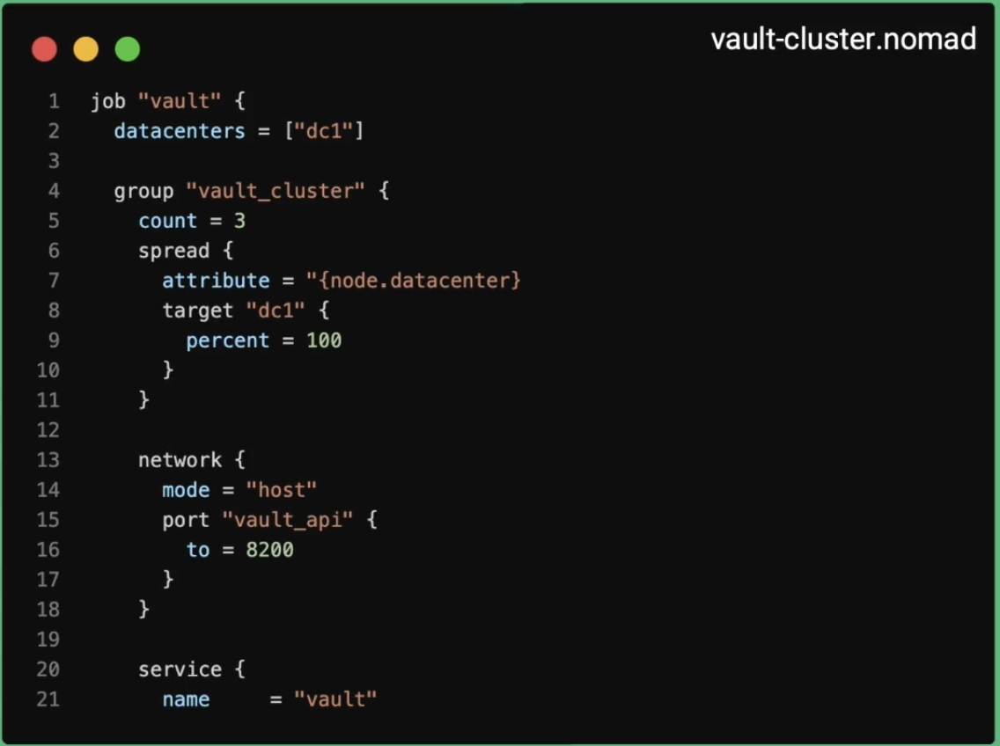
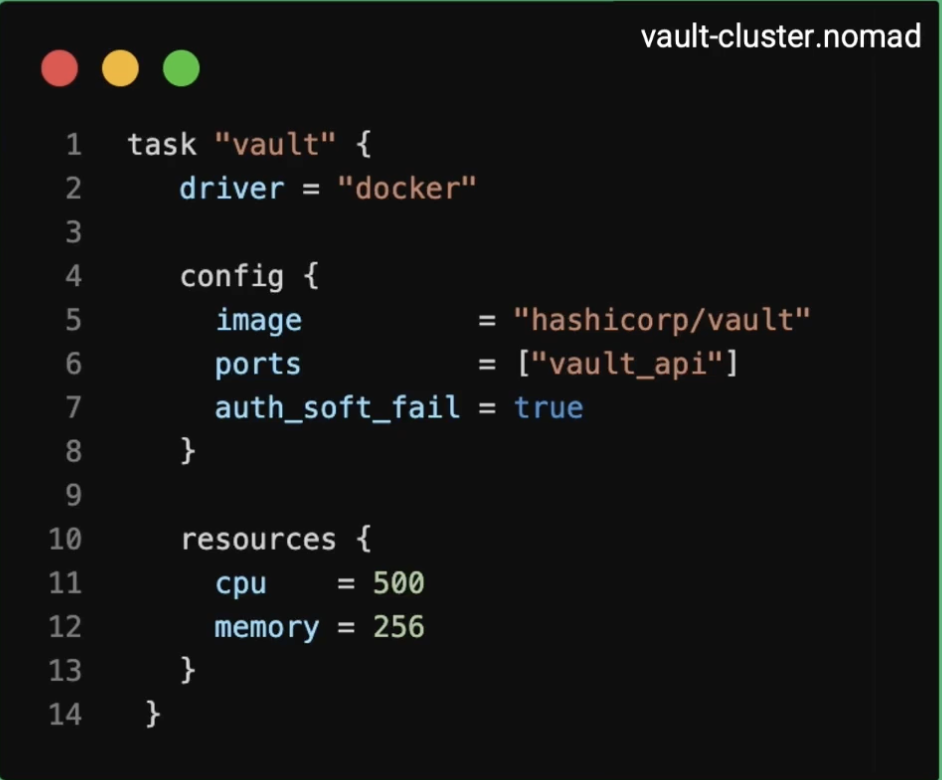
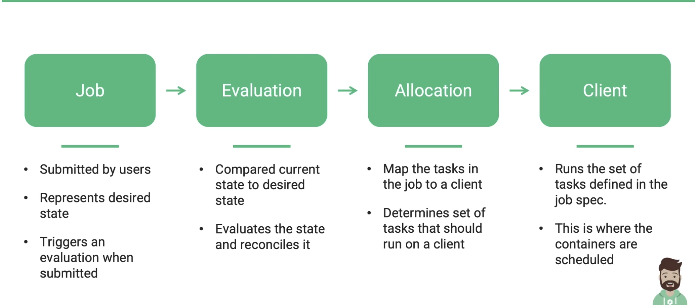

# Nomad Basics

## Nomad Components
- **Node:** A physical or virtual machine in the cluster. A node is a machine running the Nomad Agent
- **Agent:** Long runniing daemon running on every member of the nomad cluster. Agent can run in either client or server mode. This is essentially the binary that is downloaded from Hashicorp.
  - Server mode: Agent running on server mode holds the global state of the cluster and participates in scheduling decisions
  - Client Mode: Agent that fingerprints the host to determine its capabilities, resources and available drivers. Ita responsible for running workload such as containers.
- **Jobs:** Defines how workloads (or containers) should be scheduled. The spec is composed of one or more task groups, each task defines a series of resource configs and constraints
  - A job is submitted to Nomad represents a desired state. Ex: run 3 instances of given application, using the Docker mage supplied, spread them accross 3 nodes to ensure high availability.
- **Jobspec:** The jobspec defines the desired state in HCL(Hashicorp Configuration Language) or can be written in JSON but HCL is preferred.
  - It'll define multiple stanzas that define configs such as jobs, gruoups, tasks, services and resources fot the application.
  
- **Driver:** Driver is a pluggable component that executes a task and provide ressource isolation. Ex:  Docker, Java, Podman etc.
  - Driver must be installed/available before tasks can be executed
- **Task:** A task is a set of work to be executed by Nomad. Tasks are executed by Drivers. Ex: Run these containers, Execute these commands,run this application using xyz.jar.
  
- **Task Group:** Its group of tasks that need to be colocated on same node. Any task within defined group will be placed on same Nomad client.
- **Evaluation:** Is a calculation performed by nomad servers to determine what actions need to take place to execute a job.
  - Nomad performs evaluations whenever jobs are submitted or client state changes to determine if what changes need to be made to ensure the desired state.
- **Allocation:** Mapping of tasks in a job clients is done using allocations. Allocations can fail if there are no enough resources on the node to execute the given task or node is down.

**Job Lifecycle**


**Install Nomad on Mac:**

Run the following commands to install Nomad on MAC its used mainly for testing:
```
brew tap hashicorp/tap
brew install hashicorp/tap/nomad
```